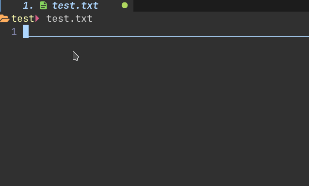

# cmp-rime

在 neovim 中通过补全方式输入中文的插件.

## 演示



## 依赖

- [neovim](https://github.com/neovim/neovim)
- [nvim-cmp](https://github.com/hrsh7th/nvim-cmp)
- [librime](https://github.com/rime/librime)

## 特性

- 因为是调用**librime**实现的补全, 所以 rime 可以实现的输入方案/语言基本都可以,经测试全拼,双拼,五笔均可用

- 通过 neovim 内置的**luajit**调用的 librime 库, 不需要编译, 而且 **速度超快**

- **中英混输**, 空格上屏中文, 回车上屏原始英文输入, 并追加一个空格

- 根据常见的输入习惯, 可设置分号引号**选二三词**, 逗号/句号或减号/等号**翻页**, 支持 1-9**数字选词**

- 预选中第一项, 可直接**空格上屏第一项**, 对于长句输入可**连续选词**

- 五笔/音形类等低重码方案可以设置唯一候选项**自动上屏**

- **跨平台**, 理论上只要有 librime 链接库就可以用, 但我没在 windows 和 mac 上测试过

- 可在多个 neovim 实例中使用

- 和其他 source 共存

## 配置

```lua
-- default settings
require("cmp_rime").setup({
    -- linux/mac用户只需要从软件源中安装rime
    -- windows用户可能需要指定librime.dll路径, 没测试过
    libpath = "librime.so",
    traits = {
        -- windows 用户的在小狼毫的程序文件夹
        shared_data_dir = "/usr/share/rime-data",
        -- 最好新建一个独立的用户目录, 否则很有可能出问题
        user_data_dir = vim.fn.expand("~/.local/share/cmp-rime"),
        log_dir = "/tmp/cmp-rime/log",
    },
    enable = {
        global = false, -- 全局开启, 不建议
        comment = true, -- 总是在comment中开启
        -- 其他情况手动开关
    },
    auto_commit = false, -- 五笔/音形类方案可用, 唯一候选项自动上屏
    number_select = 5, -- 映射1-5为数字选词, 最大支持到9, 0表示禁用
})

require("cmp").setup({
    sources = {
        { name = "rime" },
        ...
    },
    sorting = {
        comparators = {
            require("cmp.config.compare").sort_text, -- 这个放第一个, 其他的随意
            ...
        },
    },
},

    mapping = cmp.mapping.preset.insert({
        ["<C-Space>"] = require("cmp_rime").mappings.toggle_menu,
        ["<Space>"] = require("cmp_rime").mappings.space_commit,
        ["<CR>"] = require("cmp_rime").mappings.confirm,

        -- 或者设置为 cmp.select_next_item({ behavior = cmp.SelectBehavior.Select })
        --            cmp.select_prev_item({ behavior = cmp.SelectBehavior.Select })
        ["<C-n>"] = cmp_rime.mapping.select_next_item,
        ["<C-p>"] = cmp_rime.mapping.select_prev_item,

        ["."] = require("cmp_rime").mapping.page_down,
        [","] = require("cmp_rime").mapping.page_up,

        [";"] = require("cmp_rime").mapping["2"],
        ["'"] = require("cmp_rime").mapping["3"],
        -- 数字选词也可独立设置, 可设置1-9
        ["1"] = require("cmp_rime").mapping["1"],
        ...
    })
})

vim.keymap.set({ "i" }, "<C-g>", function()
    require("cmp_rime").mapping.toggle()
end, { desc = "toggle rime" })
```

## Known Issues

补全插件毕竟不是一个图形前端, 没法实现 rime 的全部功能, 但基本可以用了, 目前在使用上还存在一些小问题:

- 当光标前面有英文时, 想要输入中文会把前面的英文纳入匹配范围

- 暂时没法自动调词频, 应该是我写法的问题

- 由于 cmp 的排序机制, rime 返回的补全项并不完全按顺序排列, 所以有时看到第一项的位置上下乱跳

- 和 librime-lua 不兼容, 会导致本插件启动时 neovim 直接崩溃

## 画饼

- [ ] 解决以上问题

- [ ] 更多 librime 的配置接口, 比如候选词数量,方案选择, 繁简转换等, 目前只能通过修改 rime 用户配置文件解决

- [ ] ...

## 致谢

本项目主要参考了以下项目:

- [rime_lua](https://github.com/zhaozg/rime_lua) 实现了用 luajit 对 rime-api 的封装, 和 rime 交互的代码主要修改自这个项目
- [rime-ls](https://github.com/wlh320/rime-ls)
- [cmp-flypy.nvim](https://github.com/wasden/cmp-flypy.nvim)
- [cmp-rime](https://github.com/Ninlives/cmp-rime)
